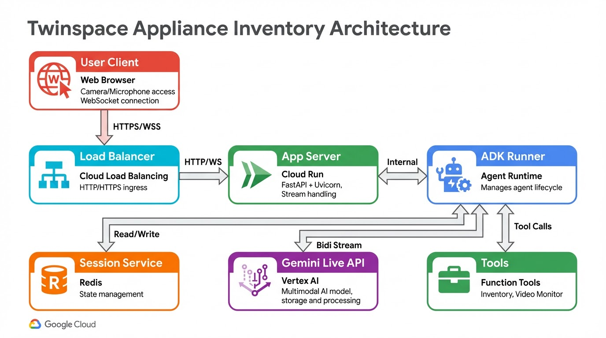

# Appliance Inventory - Live Video Application

Real-time appliance detection and inventory management using Gemini Live API with bidirectional video/audio streaming.

## Features

- 📹 **Live Video Streaming**: Real-time camera feed at 1 FPS for appliance detection
- 🤖 **AI-Powered Detection**: Gemini 2.5 Flash Native Audio model identifies appliances
- 🎙️ **Voice Interaction**: Natural voice conversations for inventory building
- 📝 **Smart Follow-up**: Agent asks questions to capture make and model
- 💾 **Session Management**: Persistent inventory across sessions
- 🎨 **Modern UI**: Responsive web interface with real-time updates

## Architecture



```
┌─────────────────┐
│   Web Browser   │
│  (Camera/Mic)   │
└────────┬────────┘
         │ WebSocket (BIDI)
         ▼
┌─────────────────┐
│  FastAPI Server │
│   (uvicorn)     │
└────────┬────────┘
         │
         ▼
┌─────────────────┐       ┌──────────────────┐
│   ADK Runner    │◄─────►│  Session Service │
│  (Live API)     │       │   (In-Memory)    │
└────────┬────────┘       └──────────────────┘
         │
         ▼
┌─────────────────┐
│  Gemini Live    │
│  Native Audio   │
└─────────────────┘
```

## Prerequisites

- Python 3.10 or higher
- [uv](https://github.com/astral-sh/uv) package manager
- Google Cloud Project with Vertex AI API enabled
- Camera and microphone access in browser

## Setup

### 1. Install uv

```bash
curl -LsSf https://astral.sh/uv/install.sh | sh
```

### 2. Clone and Configure

```bash
git clone <repository-url>
cd appliance-inventory

# Copy environment template
cp .env.template .env

# Edit .env with your Google Cloud project details
# GOOGLE_CLOUD_PROJECT=your-project-id
# GOOGLE_CLOUD_LOCATION=us-central1
```

### 3. Install Dependencies

```bash
uv sync
```

### 4. Run Application

```bash
uv run uvicorn app.main:app --host 0.0.0.0 --port 8000 --reload
```

### 5. Open Browser

Navigate to: http://localhost:8000

## Running with ADK

You can also run the agent using the Agent Development Kit (ADK) CLI:

### 1. Run via CLI

```bash
uv run adk run app.appliance_agent
```

### 2. Run via Web Interface

```bash
uv run adk web app.appliance_agent --port 8000
```

## Usage

1. **Start Camera**: Click "Start Camera" to activate your device camera
2. **Connect**: Click "Connect to AI" to establish WebSocket connection
3. **Walk Around**: Point camera at appliances as you move through your home
4. **Respond**: Answer agent's questions about each detected appliance
5. **View Inventory**: See your growing appliance list in the Inventory panel

## Development

### Run Tests

```bash
uv run pytest tests/ -v
```

### Lint Code

```bash
uv run ruff check .
```

### Format Code

```bash
uv run ruff format .
```

### Project Structure

```
appliance-inventory/
├── app/
│   ├── __init__.py
│   ├── main.py                    # FastAPI app with WebSocket
│   ├── appliance_agent/
│   │   ├── __init__.py
│   │   ├── agent.py               # ADK agent definition
│   │   └── tools/
│   │       ├── __init__.py
│   │       ├── inventory.py           # Inventory management tools
│   │       └── video_monitor.py       # Video monitoring tools
│   └── static/
│       ├── index.html             # Main UI
│       ├── css/style.css
│       └── js/
│           ├── app.js             # Main application logic
│           ├── video-handler.js   # Camera/video capture
│           ├── audio-player.js    # Audio playback
│           ├── audio-recorder.js  # Audio recording
│           └── pcm-recorder-processor.js
├── docs/
│   └── plans/
│       └── 2026-02-19-appliance-inventory-live-video.md
├── tests/
│   ├── conftest.py
│   ├── test_inventory_tool.py
│   ├── test_appliance_agent.py
│   ├── test_websocket.py
│   └── test_integration.py
├── pyproject.toml
├── .env.template
├── README.md
└── DEPLOYMENT.md
```

## Technical Details

### Video Processing

- Captures frames at 1 FPS (aligned with Gemini Live API video processing rate)
- Sends JPEG-encoded frames via WebSocket
- Resolution: 1280x720 (configurable)

### Audio Processing

- Sample rate: 16 kHz mono
- Format: PCM 16-bit
- Bidirectional: User voice input + Agent voice output

### Model Configuration

- Model: `gemini-live-2.5-flash-native-audio`
- Response modality: AUDIO (native audio)
- Streaming mode: BIDI (WebSocket)
- Session resumption: Enabled

## Troubleshooting

### Camera Access Denied

Ensure browser has camera permissions. Check browser settings.

### WebSocket Connection Failed

Verify:
- Server is running on correct port
- No firewall blocking WebSocket connections
- `.env` configuration is correct

### No Audio Output

Check:
- Browser audio permissions
- System volume settings
- Audio device selection in browser

## References

- [Gemini Live API Documentation](https://cloud.google.com/vertex-ai/generative-ai/docs/live-api)
- [ADK Documentation](https://google.github.io/adk-docs/)
- [FastAPI WebSocket Guide](https://fastapi.tiangolo.com/advanced/websockets/)

## License

MIT License - See LICENSE file for details
